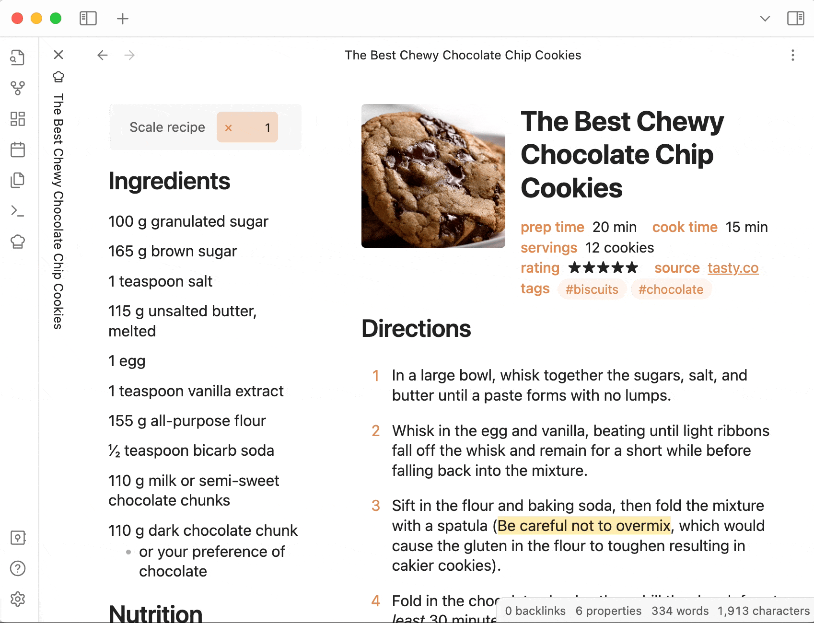
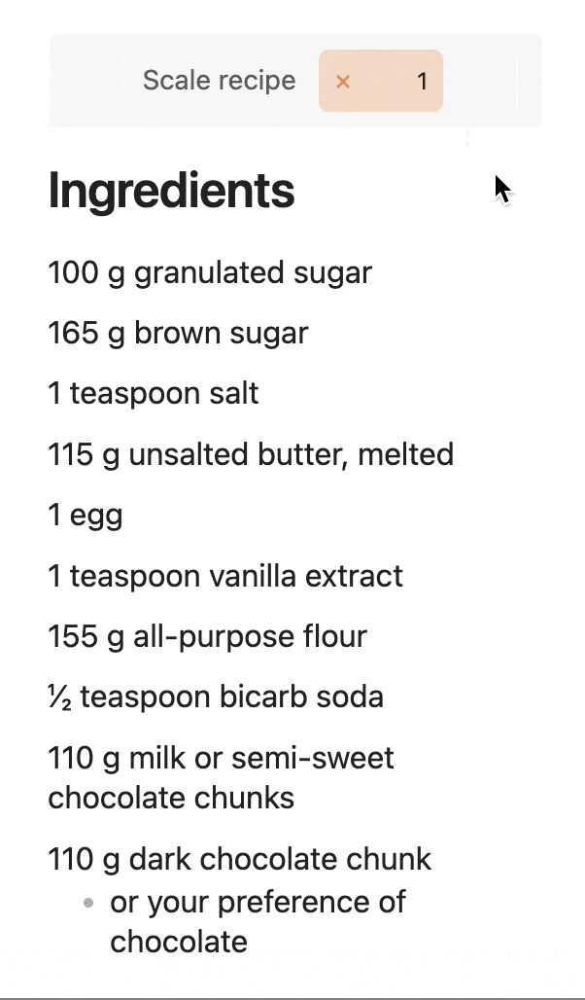
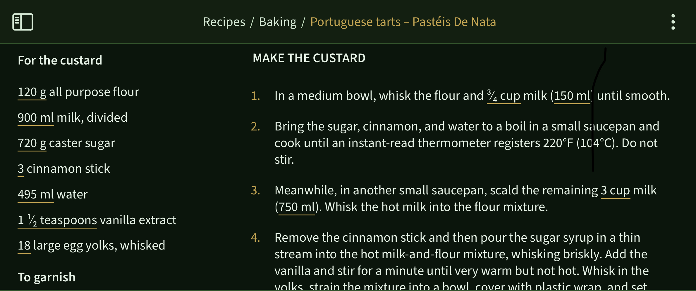

# 🧑‍🍳 Obsidian Recipe View 🥘

<a href="https://github.com/lachholden/obsidian-recipe-view/releases/latest">)</a> <a href="https://github.com/lachholden/obsidian-recipe-view/blob/release/LICENSE"></a> <a href="https://github.com/lachholden/obsidian-recipe-view/actions/workflows/npm_build.yml"></a>


*Bring Obsidian with you into the kitchen*


---

Store, write, and manage your recipes in as regular Obsidian notes in **portable, future-proof markdown**, then view them as a gorgeous **interactive recipe card** when it's time to cook in the kitchen.

**Features include:**
- 📒 Works with your recipes as-is, in whatever format you like to write them
- 🎨 Strives for maximum compatability with custom themes
- 🌈 Lets you use all the markdown that works in the rest of your vault
- ⚖️ Scales the quantities in your recipes easily
- ⚙️ Splits your recipes into two columns, for easier reference while cooking
- ✅ Makes ingredient lists cross-out-able
- 📌 Lets you highlight steps to keep track of where you're up to
- 📱 Works on phones and tablets

**Why keep your recipes in Obsidian?**
- 🗃 Portable and future-proof markdown
- 📝 Everything is a note – keep your nicely formatted recipes in the same folders as your scanned magazine clippings
- 🌏 Cross-link and tag your recipes, link them to notes on technique, keep a baking log in your daily notes, or use Dataview or Kanban to plan out your cooking
- ☁️ Write them on your laptop, check ingredients in the store on your phone, and cook from them in the kitchen with your iPad

## Usage

Here's a tour of the main features.



### Activation
When you have the note for the recipe you want to view active, click the chef's hat icon in the ribbon or use the "Toggle recipe view and markdown view" command. To make any edits to the recipe, use either of these same methods again to return to the normal markdown editor.

### Formatting
The plugin is designed to not enforce any kind of strict format on your recipe notes, and should handle lots of different methods gracefully. That said, a suggested standard format to work best with this plugin is:

```markdown
![[thumbnail.jpg]]

Any preamble can go here.

## Ingredients
**Section 1**
- bulleted lists
- quantities at the start, e.g.:
- 180 grams butter
- 3 eggs

**Another section**
- Feel free to split your ingredients up
  - and add notes underneath
- You don't need any bold headings if you don't want
- 15 of [[Another recipe]], pre-made

## Directions
1. Numbered lists
2. Feel free to include any markdown you like in your steps
3. You can also split these up in sections, with bold or level 3+ headings

## Notes
Anything else you want can go here.

## Nutrition
Common when recipes are downloaded from the web
```

Feel free to adapt the suggested format however you like though – and if there's a certain style you prefer that does not work well with the plugin currently, create an issue with an example recipe.

**The plugin currently follows the following rules for formatting the recipe card:**
- Configure in the plugin settings which sections you want to be pulled into the side column, based on their headings – the default is `Ingredients|Nutrition`.
- Any bulleted lists in the side column *or* that appear before any heading will be converted into checkable ingredient lists – just click items to cross them out.
    - After focusing an ingredient (e.g. by clicking, tabbing) you can also use Tab and Shift+Tab to change the highlighted ingredient and Space to toggle crossing it out.
    - Click or tab elsewhere to stop highlighting the last-changed ingredient.
- Any numbered lists or sequences of paragraphs in the main column will let you click on a step to highlight it. Click a different step to move the highlight.
    - After focusing a group of steps (e.g. by clicking, tabbing) you can also use the arrow keys to move the selected step.
- The first image in your note that is not under a heading is pulled out as a thumbnail. All properties/front matter fields in your note are displayed under the title.


### Scaling ingredients


Easily scale the ingredient quantities in your recipes using the widget at the top of the side column. By default, it will scale detected quantities in checkable ingredient lists only. Numbers will be detected as quantities if either they are alone at the start of a bit of a text (e.g. "**1** egg" or "**2** dashes of brandy"), or if they are with a usual scaled cooking unit anywhere in text (e.g. "plus an extra **50 g** for dusting"). The number can be in any of the following formats:
- 450 g – an integer
- 1/4 tsp – a text fraction
- ½ cup – a unicode fraction
- 3.5 litres – a decimal number
- 2 3/4 sticks – a mixed text number
- 1¾ kg – a mixed unicode number (with or without space in between)
- 1-1/4 oz. – a mixed number separated by a dash (both text and unicode work)

#### Scaling display
When rescaling, units will be displayed as either a decimal or a fraction based on what was used in the original, or if the original was an integer then a choice is made based on the unit used. All displayed fractions are presented as mixed numbers with the fraction part rounded to the nearest 1/16, and they will be nicely rendered in unicode regardless of the input format. There does not need to be a space between the number and the unit, but all quantites will be rendered with a space. Likewise, any dashes in mixed numbers will be rendered as a space.

If the recipe is scaled, any quantities that have been adjusted will have an underline to make it clear what has and has not changed.

#### Manual control
To scale certain quantities in other sections e.g. in the directions, wrap them like `<span data-qty-parse>180 grams</span>`. You could also wrap a whole step in the same tags to parse all present quantities. In most recipes, quantities outside the ingredient lists don't need to be scaled, but an example where it is useful using these `<span>` tags is shown below.



In the markdown, step 3 looks like:
```markdown
3. Meanwhile, in another small saucepan, scald the remaining <span data-qty-parse>1 cup milk (250 ml)</span>. Whisk the hot milk into the flour mixture.
```

To stop a certain quantity from being scaled mistakenly, wrap it like `<span data-qty-no-parse>30 centimetres</span>`.

### Keyboard shortcuts
All of the following shortcuts require some element of the recipe card to be focused to work, so after opening you will need to click or tab to an ingredient/step/the scale textbox. As you use the keyboard shortcuts, the columns will automatically scroll to keep your updates in view. 

- Use <kbd>j</kbd> and <kbd>k</kbd> to highlight the next/previous step.
- Use <kbd>n</kbd> and <kbd>p</kbd> to check off the next ingredient or uncheck the previous ingredient.
- Use <kbd>,</kbd> and <kbd>.</kbd> to scale the recipe in increments of 0.25.

### Additional settings
The [Style Settings](https://github.com/mgmeyers/obsidian-style-settings) plugin will let you configure aspects of how the recipe card appears.

## Attribution
- Recipes used in the screenshot examples
    - [Tasty.co's Chewy Chocolate Chip Cookies  ](https://tasty.co/recipe/the-best-chewy-chocolate-chip-cookies)
    - [Leite's Culinaria's Pastéis de Nata / Portuguese Custard Tarts](https://leitesculinaria.com/7759/recipes-pasteis-de-nata.html)
- Themes used in the screenshot examples
    - Default Obsidian theme with Orange accent
    - [Damian Korcz's excellent Prism Theme](https://github.com/damiankorcz/Prism-Theme)
- In top preview image & social media preview
    - Photo by <a href="https://unsplash.com/@andyc?utm_source=unsplash&utm_medium=referral&utm_content=creditCopyText">Andy Chilton</a> on <a href="https://unsplash.com/photos/0JFveX0c778?utm_source=unsplash&utm_medium=referral&utm_content=creditCopyText">Unsplash</a>
  